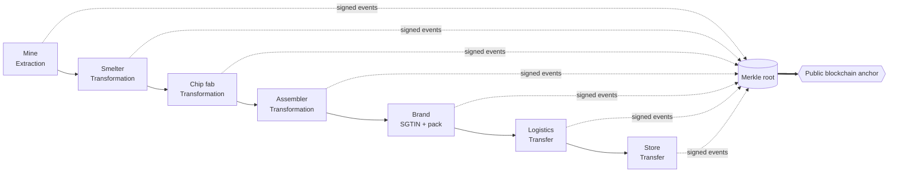
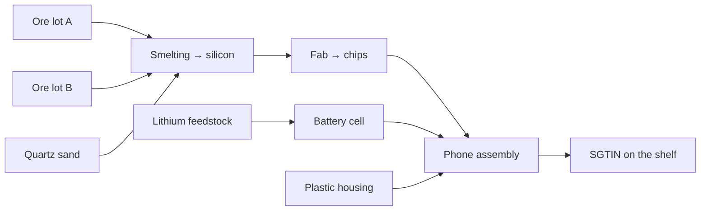
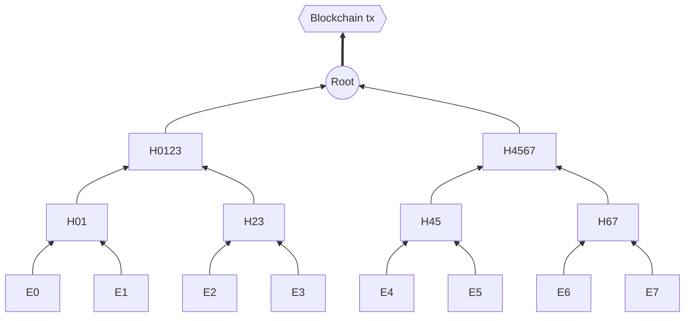
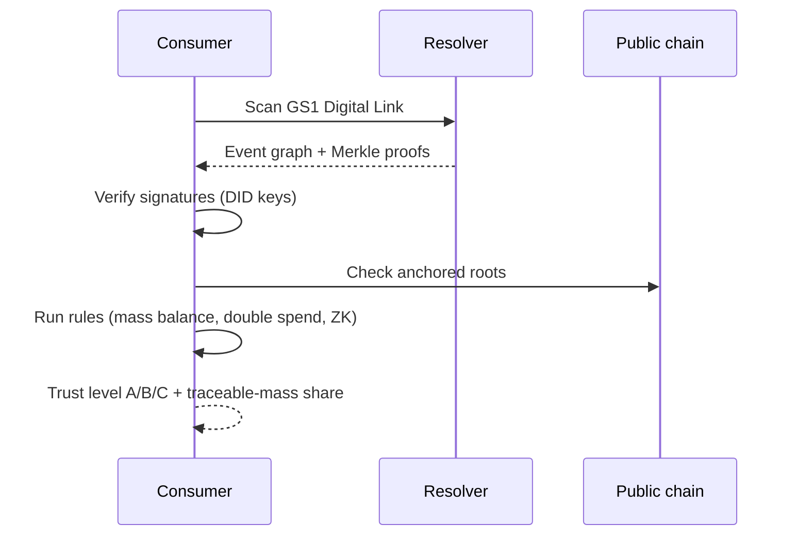

<p align="center"></p>

<h1 align="center">Origo Protocol</h1>

<p align="center">
  An open cryptographic protocol and registry for verifying the provenance of every product —<br/>
  from raw material (ore, grain, silicon) to the box on the shelf.
</p>

<p align="center">
  
  
  
</p>

> ⚠️ **Draft specification + educational reference core.** Not a production system.

## TL;DR

Every participant in a supply chain **cryptographically signs** what they did with a lot or product. Signed events link into a provenance graph (DAG), and their hashes are periodically **anchored on a public blockchain**. Anyone can verify a product's history **without trusting** the seller, the brand or the platform operator.

- **Data stays with participants.** Only hashes and Merkle roots go on-chain.
- **Compatible with GS1 / EPCIS 2.0.** Adds verifiability instead of replacing standards.
- **Private by default.** Trade secrets are protected; claims are proven with ZK.
- **Honest about limits.** A blockchain can't see the physical world — see [Limitations](#limitations).

## Why

Counterfeits, laundered raw materials, forced labor, undeclared carbon footprint, recalls that take weeks — all share one cause: product history is **fragmented across closed systems and can't be verified without an intermediary.**

| Today | With Origo |
|-------|-----------|
| Closed databases per company | One event format, signed by every participant |
| "Trust this PDF certificate" | Certificate is a hash inside a signed, anchored event |
| Recall takes weeks | Lot → units → stores graph in seconds |
| Only auditors can check origin | Anyone can verify, locally, on a phone |

## How it works



1. The **mine** registers a lot of ore (`Extraction`) and signs the event.
2. The **smelter** consumes the lot and outputs silicon (`Transformation`): inputs and outputs are explicit.
3. The **fab**, **assembler** and **brand** continue the chain; the brand assigns a serialized ID (SGTIN).
4. **Logistics and the store** record custody changes (`Transfer`).
5. Every few minutes, participants publish a **Merkle root** to an aggregator, which publishes a super-root on-chain.
6. A **GS1 Digital Link** on the pack lets any client fetch and verify the event graph.

## Protocol layers

| Layer | Purpose |
|-------|---------|
| **L0** Physical binding | DataMatrix, NFC, PUF, isotopic/DNA markers, IoT sensors |
| **L1** Identity | DIDs, verifiable credentials, GS1 identifiers |
| **L2** Events | Signed events, provenance DAG |
| **L3** Anchoring | Merkle roots on public L1/L2 via aggregators |
| **L4** Verification | Signatures, Merkle proofs, mass balance, ZK |
| **L5** Applications | Scanner, ERP/WMS, customs, audit |

## Data model



An event is signed JSON with a content-addressed ID:

```json
{
  "id": "ev:<sha256(JCS(body))>",
  "type": "Transformation",
  "actor": "did:origo:9b2c41d7e0a85f13",
  "time": "2026-03-14T09:42:00Z",
  "process": "smelting",
  "inputs":  [{ "id": "lot:ore-A", "qty": 1000, "unit": "kg" }],
  "outputs": [{ "id": "lot:si-1",  "qty": 400,  "unit": "kg" }],
  "signature": "ed25519:…"
}
```

**Invariants every verifier checks**

| # | Invariant | Defends against |
|---|-----------|-----------------|
| 1 | ID = hash of content | data tampering |
| 2 | Valid signature for the actor's key | impersonation |
| 3 | **Mass balance:** output ≤ input × max_yield | "multiplying" certified material |
| 4 | **No double spend** of a lot | selling one lot twice |
| 5 | Causal time ordering | backdating history |
| 6 | Required accreditation present | fake certificates |

## Anchoring



An inclusion proof is just ~log₂(n) sibling hashes (≈1 KB), so any event can be proven without revealing the others. Anchoring gives immutability, provable timing and no data leakage (32 bytes per batch).

| Task | Choice |
|------|--------|
| Hash | SHA-256 |
| Signatures | Ed25519 (fallback: ML-DSA) |
| Canonicalization | RFC 8785 JCS |
| Identity | W3C DID + Verifiable Credentials |
| Tree | Merkle with domain separation |
| Private claims | ZK (Groth16/PLONK, STARK) |

## Verification



## Privacy

| Mode | Verifier sees |
|------|---------------|
| `public` | the full event |
| `committed` | event hash + ZK proofs of claims |
| `permissioned` | full event, only for key holders |

## Scale (back-of-the-envelope)

| Quantity | Estimate |
|----------|----------|
| Events worldwide at peak | ~10¹² / day |
| Data volume | ~300 TB / day — **kept by participants, not on-chain** |
| On-chain transactions via aggregators | ~2,400 / day |
| Inclusion proof size | ≈ 1 KB / event |

## Limitations

> **A blockchain guarantees a record wasn't altered — not that it is true.**

- **Oracle problem:** a false input claim isn't caught by cryptography. Mitigations: accredited auditors, lab markers, IoT/satellite data, accountability of the signer.
- **Physical binding** for bulk goods (grain, ore) is an open research problem.
- **Informal sectors** can't be forced in; start with regulated, high-value chains.
- **Metadata:** even encrypted, the link graph can reveal business structure.
- **Auditor economics:** conflict of interest when the audited party pays.

## Quick start

Python 3.9+, no dependencies (real Ed25519 is used if `cryptography` is installed):

```bash
cd origo-protocol
python3 origo_demo.py
```

The demo builds **ore → silicon → chip → phone → shelf**, then simulates a double-spend attack and tampering, and verifies a Merkle inclusion proof.

## Repository layout

```text
origo-protocol/
├── README.md            ← you are here
├── SPEC.md              full specification: layers, events, crypto, threats, governance, roadmap
├── event.schema.json    JSON Schema of an Origo event
├── origo_demo.py        reference core: events, DAG, rules, Merkle anchoring
├── assets/architecture.svg
└── LICENSE              MIT (code); spec under CC BY 4.0
```

## Roadmap

| Stage | Goal |
|-------|------|
| 0 · Draft (now) | Event format, threat model, reference core |
| 1 · Spec v0.1 | DID profile, process registry, test vectors |
| 2 · Pilot | One regulated chain (critical minerals / batteries) |
| 3 · Tags & audit | Secure tags, auditors, ZK claims |
| 4 · Federation | Multiple aggregators, multi-chain anchoring |
| 5 · Scale | Consumer apps, customs, marketplaces |

## Contributing

Cryptographers, supply-chain experts, hardware/tag engineers and privacy/regulatory lawyers are welcome. Protocol changes go through an RFC (issue first, then a pull request).

## License

Code: [MIT](LICENSE). Specification text: CC BY 4.0.
